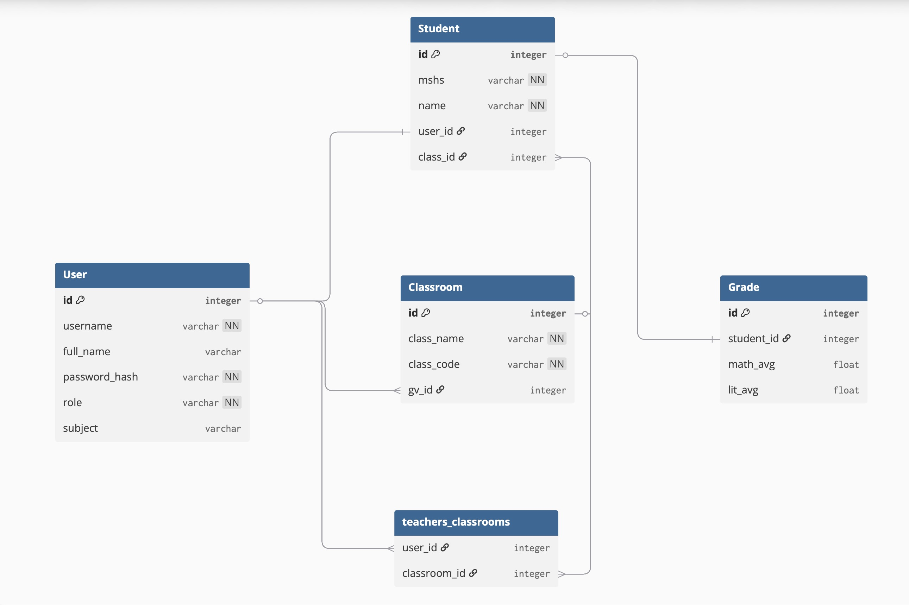

# Trình quản lí điêm số cho trường học

Đây là hệ thống đơn giản để giáo viên và học sinh lưu trữ, quản lí kết quả học tập ở trường, được thiết kế cụ thể cho học sinh Việt Nam.

## Tính năng

### Quản lí người dùng
* Đăng nhập, đăng kí, phân quyền (học sinh / giáo viên), hash password

### Quản lí điểm số 
* Với học sinh: xem điểm tất cả các cột, điểm trung bình môn, GPA 
* Với giáo viên: điều chỉnh điểm số **của môn mình dạy** cho từng học sinh 

### Quản lí lớp học (riêng cho giáo viên)
* Thêm lớp chủ nhiệm, thêm từng học sinh, thêm bằng file .csv
* Lọc ra các học sinh đã thêm rồi, sort danh sách học sinh
* Xem điểm trung bình môn của học sinh
* Tham gia lớp giảng dạy bằng code


## Mô tả cơ sở dữ liệu
### Tổng quan
Cơ sở dữ liệu gồm 4 bảng chính và 1 bảng trung gian để xử lý mối quan hệ nhiều-nhiều.

### Danh sách các bảng
* **User**: Lưu trữ thông tin tài khoản, mật khẩu và vai trò.

* **Classroom**: Lưu trữ thông tin lớp học và định danh giáo viên chủ nhiệm.

* **Student**: Lưu trữ thông tin định danh học sinh và liên kết lớp học.

* **Grade**: Lưu trữ tất cả các đầu điểm thành phần của học sinh.

* **teachers_classrooms**: Bảng phụ kết nối giáo viên bộ môn với các lớp họ giảng dạy.

### Mối quan hệ giữa các bảng


## Thư viện
Dự án được xây dựng bằng **Python** (version khuyến nghị 3.8) và sử dụng các thư viện:
* **Flask**
* **Flask-SQLAlchemy**
* **Werkzeug** (hash mật khẩu, xử lí bảo mật)

## Hướng dẫn cài đặt

### Clone & Setup
``` bash 
# clone project
git clone https://github.com/Soable/Grade-managing-system.git
cd Grade-managing-system

# Create virtual environment
python -m venv venv
source venv/bin/activate

# install requirements
pip install -r requirements.txt
```

### Run 
``` bash
python app.py
# then open http://localhost:5005
```